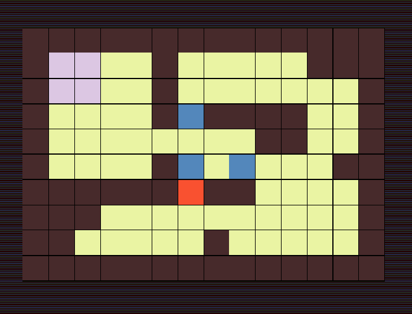

## Sokoban

 

2D logic game of moving blocks through pregenerated map.



## Technologies

- Java Swing
- Java Awt

## Requirements

- JDK 17

## Application execution

1. Make sure your JAVA_HOME paths to jdk directory.
2. Clone repository:
```
git clone https://github.com/ExaggeratedRumors/sokoban.git
```
3. Open application root directory.
4. Put command to run server-artifact (skip if your want to run offline version):
```
java -jar server.jar
```
5. Put command to run client-artifact:
```
java -jar client.jar
```

